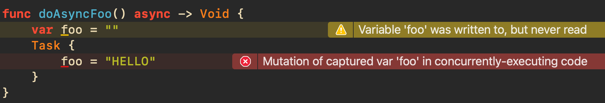
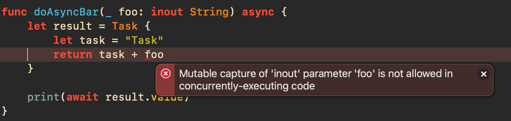

# TCA에서의 비동기 처리

## TCA와 비동기 처리

- `Effect<Action>` 는 하나의 Reducer 내부에서 State를 변형하고 관리할 수 있음.
- 때에 따라 외부 환경에서의 `Effect`를 Application에 피드백할 수도 있는데, 이 경우를 TCA에서는 Side Effect로 정의함

### **run(priority:operation:catch:fileID:line:)**

- Side Effect를 처리하는 `Effect`의 메소드임.
- `Self(Effect)`를 반환함.

```swift
var body: some ReducerOf<Self> {
    Reduce { state, action in
        switch action {
        case .onViewAppearing:
            return .none
        case .onServerRequestButtonTapped:
            return .run { send in
                // 1️⃣ 비동기 코드 실행
            } catch: {
                // 2️⃣ non-cancellation 에 대한 에러 처리
            }
        }
}
```

- 1️⃣에서 개발자는 Side Effect를 실행할 수 있음.
- 원한다면 해당 비동기 처리에 대한 `priority`도 지정할 수 있음.
- `send`라는 로컬 상수가 전달되며, 이것을 통해서 Action 및 Reduce의 흐름으로 피드백 할 수 있음.
- `catch` 처리도 가능.

### run 메소드의 역할

```swift
/* code */

case .requestButtonTapped:
		// Main Thread
    return .run { send in
				// Task Thread
        let fetchedImage = try await requestImages()
        await send(.requestResponse(fetchedImage))
    } catch: { error, send in
        print(error)
    }
    
case let .requestResponse(image):
    state.image = image
    return .none

/* code */

private func requestImages() async throws -> Image {
    Task { try! await Task.sleep(for: .seconds(1)) }
    return Image(systemName: "checkmark.circle.fill")
}
```

- `run` 함수 내에서 비동기 작업인 `requestImages()`를 호출하고 있음.
- 정상적으로 수행이 되면 결과값을 `send`를 통해서 Action의 형태로 피드백 함.
- 에러가 발생하면 `catch` 구문에서 예외 처리가 가능함.
    - 동일하게 `send`를 통해서 Action의 형태로 피드백도 가능함.

### MainActor, send

- `run(priority:operation:catch:fileID:line:)` 클로저 내부로 전달되는 `send`는 `MainActor`로서 `Send<Action>`의 인스턴스임.
- Reducer가 Side Effect의 결과를 State로 피드백 하기 위해서는 main 스레드를 사용해야 함.

### TCA에서 Action을 통해 Side Effect의 결과를 반영해야 하는 이유

비동기 흐름에서 외부의 변수(State)를 변경하려고 해보자.

```swift
func doAsyncBar() async {
    var foo = ""
    Task {
        foo = "TASK"
    }
}
```

- 위 함수는 아래와 같은 에러를 발생시킴



에러가 발생하는 이유는 아래와 같다.

1. `Task`가 생성할 새로운 스레드에서 외부에 선언된 변수의 값을 변경하려고 시도함.
2. 위 변경 작업은 어느 시점에 이루어질지 미확정 됨.

정리하자면, 다른 스레드에서 값을 변경하려고 하는 것이 문제가 되는 것이다.

```swift
func doAsyncBar() async {
    let foo = ""
    Task {
        /* Build는 성공했으나 mutate할 수 없다. */
        print("foo")
    }
}
```

- `foo`를 상수로 선언하면 `Task` 내에서 접근은 가능해지나, 값을 변경할 수는 없다.

그럼, `Task`의 처리 결과를 `Task<Result, Never>` 형태로 반환해 볼까?

```swift
func doAsyncBar() async {
    let foo = ""
    /// Task가 상수를 안전하게 capture 할 수 있고
    /// Task의 결과를 클로저 블록으로 피드백할 수 있다.
    let result = Task {
        let task = "Task"
        return task + foo
    }
    
    print(await result.value)
}

Task {
    await doAsyncBar()
}

/* PRINT
"Task_Foo"
*/

```

- `foo`를 가지고 만든 결과값을 만들 수는 있지만 여전히 `foo`를 변경하지는 못한다.

`inout`으로 구현해볼까?

```swift
// inout 으로 변형할 수 있도록 변수로 선언을 수정합니다.
var foo = "_Foo"

func doAsyncBar(_ foo: inout String) async {
    let result = Task {
        let task = "Task"
        return task + foo
    }
  
    print(await result.value)
}
```



- `inout`으로 변형될 것이 분명한 `foo`를 스레드에서 호출하는 로직은 수행할 수 없다는 에러.
- 처음 변수를 `Task`내에서 변경하려고 했을때와 동일한 맥락이다.

결국, `Task`의 맥락이 아닌 main에서 값 변경이 일어나야 한다는 것을 알 수 있음. 이를 위해서 TCA에서는 `MainActor`, `Send`를 사용함.

```swift
var foo = "_Foo"

func doAsyncBar(
    _ foo: inout String,
    mainCompletion: @escaping @MainActor (String) -> Void
) async {
    Task { [foo = foo] in
        let taskResult = "Task" + foo
        await mainCompletion(taskResult)
    }
}

Task {
    await doAsyncBar(&foo) { result in
        print("Result :", result)
        foo = result
        print("Foo :", foo)
    }
}

/* PRINT
Result : Task_Foo
Foo : Task_Foo
*/
```

- `foo`를 `inout` 파라미터로 받고 있기 때문에, `Task` 클로저내에서 사용하려면 캡처해야 함
- 값 변경은 main에서 실행되어야 하므로 `MainActor` 탈출 클로저에서 `Task`외부의 `foo` 값을 변경하도록 수정한다.
- TCA에서는 이러한 문제를 고민하지 않도록 `MainActor`, `send`를 제공한다.

```swift
case .requestButtonTapped:
		// send는 위의 예시에서 살펴봤던 것과 동일한 MainActor이며
		// 피드백을 위해 Action 타입을 활용하고 있다.
		// Task의 자리에 .run이 위치하며, 동시에 MainActor를 전달하기 때문에
		// 비동기 처리가 더욱 쉬워진다.
    return .run { send in
        let fetchedImage = try await requestImages()
        await send(.requestResponse(fetchedImage))
    } catch: { error, send in
        print(error)
    }
    
case let .requestResponse(image):
    state.image = image
    return .none

/* code */

private func requestImages() async throws -> Image {
    Task { try! await Task.sleep(for: .seconds(1)) }
    return Image(systemName: "checkmark.circle.fill")
}
```

### 구조화된 Task

- `.run(priority:operation:catch:fileID:line:)` 내부에서 실행되는 `Task`를 취소할 수도 있고 `throw` 메소드의 에러를 `catch`할 수 있다.
    - `send`메소드 내에서 `Task.isCancelled`로 취소를 확인하고 작업을 수행하는 방식.

```swift
struct CancelFeat: Reducer {
    enum CancelKey {
        static let cancelAsync = "CANCEL_ASYNC"
    }

    struct State: Equatable { /* code */ }
    
    enum Action: Equatable {
        case runAsync
        case cancelAsync
        case asyncResponse
    }
    
    var body: some ReducerOf<Self> {
        Reduce<State, Action> { state, action in
            switch action {
            case .runAsync:
                return .run {
                    try await Task.sleep(for: .seconds(3))
                    await $0(.asyncResponse, animation: .easeInOut)
                } catch: { error, send in
                    print(error)
                    await send(.asyncResponse)
                }
                .cancellable(id: CancelKey.cancelAsync)
            
            case .asyncResponse:
                return .none
                
            case .cancelAsync:
                return .cancel(id: CancelKey.cancelAsync)
            }
        }
    }
}
```

- `Effect`뒤에 `cancellable`을 추가해서 취소할 작업의 `id`를 지정해줄 수 있다.
- `cancelAsync` Action에서 보듯 `cancel`을 통해서 특정 `id`의 작업을 취소할 수 있다.
