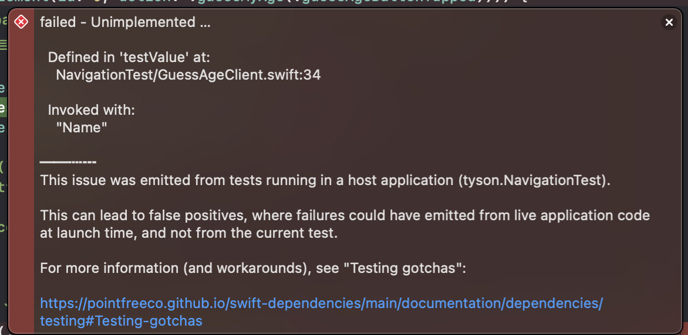

# TCA와 Testable Code

- TCA는 State를 변형하는 Action들의 열거하여 정의하는 방식으로 앱의 상태를 제어 함.
- State의 변형은 Action에 의한 변형을 관리하는 Reducer가 책임을 갖고 있음.
    - 또한 각 Reducer는 독립적임.
- `ifLet()`, `forEach()`, 등의 Reduce 메소드로 다른 Reducer와의 유기적 관계도 맺을 수 있음.

이러한 상황에서 기능 개발을 할 때 개발자는 아래와 같은 사항을 고려해야 함.

1. State가 의도한대로 변형되었는지?
2. 각 Reducer의 State와 Action이 잘 전달되고 있는지?
3. 특정 Action을 트리거 할 때, 다른 Action(Side Effect)이 제대로 피드백 되는지?

## TCA가 지향하는 Testable Code의 장점

1. 테스트하고 싶은 기능을 빠르게 구현할 수 있고, Action의 흐름을 점검할 수 있다.
2. Dependency 커스텀을 통한 서버 의존성을 완전이 배제하여 테스트를 할 수 있다.
3. Action의 기본 flow를 벗어나는 사용 flow를 테스트할 수 있다.
4. Action의 send와 receive를 제어할 수 있는 기능을 제공한다.(withExhaustivity)
5. 친절하고 명확한 실패 log를 볼 수 있다.

# 코드 예시

아래 예시는 나이를 추측하는 게임에 대한 구현이다.

## 기본 구현

## Root Reducer: AppFeature

```swift
import ComposableArchitecture

@Reducer
struct AppFeature {
    struct State: Equatable {
        var path = StackState<Path.State>()
        var recentGuessMyAgeInformation: String?
    }
    
    @CasePathable
    enum Action: Equatable {
        case path(StackAction<Path.State, Path.Action>)
        case childHasBeenModified(String)
    }
    
    var body: some ReducerOf<Self> {
        Reduce<State, Action> { state, action in
            switch action {
            case let .path(.element(id: id, action: .guessMyAge(.guessAgeResponse(_)))):
                guard let guessMyAgeState = state.path[id: id, case: \.guessMyAge]
                else { return .none }
                
                if !guessMyAgeState.isGuessAgeIncorrect {
                    return .send(.childHasBeenModified(guessMyAgeState.name))
                }
                return .none
                
            case .path:
                return .none
            case let .childHasBeenModified(name):
                state.recentGuessMyAgeInformation = name
                return .none
            }
        }
        .forEach(
            \.path,
             action: \.path
        ) {
            Path()
        }
    }
    
    @Reducer
    struct Path {
        enum State: Equatable {
            case guessMyAge(GuessMyAgeFeature.State)
        }
        
        @CasePathable
        enum Action: Equatable {
            case guessMyAge(GuessMyAgeFeature.Action)
        }
        
        var body: some ReducerOf<Self> {
            Scope(state: \.guessMyAge, action: \.guessMyAge) {
                GuessMyAgeFeature()
            }
        }
    }
}
```

- 최상위 Reducer
- `NavigationStack`으로 drill-down 뷰를 표시하기 위한 `Path`를 가지고 있음.
    - `Path`에는 `guessMyAge` 하나 달랑 있음.
- `guessMyAge` path에서 `guessAgeResponse` Action을 수신하면 자신의 `childHasBeenModified` Action을 트리거해서 본인의 State를 업데이트하는 Reduce를 가지고 있음.

## ChildReducer: **GuessMyAgeFeature**

```swift
@Reducer
struct GuessMyAgeFeature {
    @Dependency(\.guessAgeClient) var guessAgeClient
    
    struct State: Equatable {
        var name: String
        var age: Int?
        var isGuessAgeButtonTapped: Bool = false
        var isGuessAgeIncorrect: Bool = false
    }
    
    @CasePathable
    enum Action: Equatable {
        case nameTextFieldEditted(String)
        case emptyNameTextFieldButtonTapped
        
        case guessAgeButtonTapped
        case guessAgeResponse(GuessAge)
        case guessAgeFetchFailed
    }
    
    var body: some ReducerOf<Self> {
        Reduce<State, Action> { state, action in
            switch action {
            case let .nameTextFieldEditted(name):
                state.name = name
                return .none
                
            case .emptyNameTextFieldButtonTapped:
                state.name = ""
                return .none
                
            case .guessAgeButtonTapped:
                state.isGuessAgeButtonTapped = true
                state.age = nil
                state.isGuessAgeIncorrect = false
                
                return .run { [name = state.name] send in
                    let result = try await guessAgeClient.singleFetch(name)
                    await send(
                        .guessAgeResponse(result),
                        animation: .easeInOut
                    )
                } catch: { error, send in
                    await send(.guessAgeFetchFailed)
                }
                
            case let .guessAgeResponse(result):
                state.isGuessAgeButtonTapped = false
                if let age = result.age {
                    state.age = age
                } else {
                    state.isGuessAgeIncorrect = true
                }
                
                return .none
                
            case .guessAgeFetchFailed:
                // code
                return .none
            }
        }
    }
}
```

- 사용자가 입력한 나이를 바탕으로 추론하는 로직을 담당함.
- 유저가 버튼을 누르면(`guessAgeButtonTapped`) 네트워크 통신을 진행함.
    - 이 부분에서 서버에 의존성이 생기지만 테스트시에는 서버 의존성을 제거하고 테스트하는 방법을 해볼것임.

## Dependencies

```swift
import ComposableArchitecture

protocol GuessAgeClient {
    var singleFetch: @Sendable (String) async throws -> GuessAge { get set }
}

struct GuessAgeClientImpl: GuessAgeClient {
    var singleFetch: @Sendable (String) async throws -> GuessAge = { _ in
        return GuessAge(age: 14)
    }
}

struct GuessAgeClientMock: GuessAgeClient {
    var singleFetch: @Sendable (String) async throws -> GuessAge = { _ in
        return GuessAge(age: 0)
    }
}

enum GuessAgeClientKey: DependencyKey {
    static var liveValue: any GuessAgeClient {
        GuessAgeClientImpl()
    }
    
    static var testValue: any GuessAgeClient {
        GuessAgeClientMock()
    }
}

extension DependencyValues {
    var guessAgeClient: any GuessAgeClient {
        get { self[GuessAgeClientKey.self] }
        set { self[GuessAgeClientKey.self] = newValue  }
    }
}

struct GuessAge: Equatable {
    var age: Int?
    
    static func testInstance() -> Self {
        Self(age: 3)
    }
}
```

- Reducer에서 사용할 Dependency들과 데이터 모델 선언

## TestStore

```swift
@MainActor
final class NavigationTestTests: XCTestCase {
    func testTextField_Writing() async throws {
        let testStore = TestStore(
            // 🧩 initialState에서 ``name``에 "Name" 리터럴을 할당
            initialState: GuessMyAgeFeature.State(name: "Name")
        ) {
            // 🧩 State를 Reduce하는 Reducer를 호출
            GuessMyAgeFeature()
        } withDependencies: { dependency in
            // 🧩 Dependency를 새로 할당하고 정의
        }
        // code
    }
}
```

- 모든 테스트 함수는 `@MainActor` 맥락에서 진행되어야 함.
    - 테스트 클래스 자체에 `@MainActor` 어노테이션 달면 편함.
- Reducer를 테스트 할 때, 실제 Store를 사용하지 않고 `TestStore`를 생성하여 테스트 함.

### send(_:assert:file:line:)

- `TestStore`에 새로운 Action을 트리거 함.
- 비동기 메소드이므로 Action이 트리거하기 전까지 일시 정지할 수 있음.
    - 덕분에 Action의 결과를 바로 확인할 수 있다.
- Data Race를 방지하기 위해 `@MainActor` 어노테이션을 가지고 있음.
- `assert` 파라미터는 `((_ state: inout State) throws -> Void)?` 이고, 해당 클로저내에서 전달된 `state`에 테스트 결과로 기대하는 값을 할당한다.
    - State에 아무런 변화가 예상되지 않으면 생략하면 됨. 옵셔널 이므로..
- `exhaustivity` 속성을 `off`로 설정하면 모든 State 변화를 무시하고 Action Flow만 검증함.
- State의 동일성 여부로 테스트 결과를 판단하기 떄문에 State는 `Equatable`을 준수하여야 함.
    - 테스트 통과 조건이 assert에 할당한 State와 실제 State가 동일한지 여부임.
        - 다만, 의존성을 가지는 Reducer에서 `@Dependency` 없이 의존성 객체를 생성하고 State의 동등성을 비교하면 값 자체가 동일하더라도 fail이 날 수 있음.
    - `assertEquals()`와 동일한 방식.

```swift
func testTextField_Writing() async throws {
    let testStore = TestStore(
        initialState: GuessMyAgeFeature.State(name: "Name")
    ) {
        GuessMyAgeFeature()
    }
    // 🧩 단순 TextField 테스트에는 의존성을 재정의할 필요가 없기 때문에
    // 🧩 ``withDependencies`` 후행 클로저 생략
    
    // 1️⃣ 특정 ``Action``을 트리거 하기 위해 ``.send(_:assert:file:line:)`` 호출
    // 2️⃣ 후행 클로저에서 ``assertEquals()``가 작동하도록 값을 할당
    // 3️⃣ send된 ``Action``이 실제로 예상 변경 값과 동일한 변화를 만들 경우,
    // 4️⃣ Test 통과
    // 🧩 initialState의 ``name``이 "NewName"을 새로 갖도록
    // 🧩 ``Action``의 연관값으로 전달
    await testStore.send(.nameTextFieldEditted("NewName")) { state in
        // 🧩 ``TestStore``의 ``State``를 받아온 후,
        // 🧩 해당 값이 실제로 "NewName"으로
        // 🧩 정상적으로 할당될 것인지 테스트
        state.name = "NewName"
        // ✅ ``State``의 변형이 실제와 동일하다면 테스트 통과
    }
}
```

### receive(_:timeout:assert:file:line:)

- 어떤 Action의 Side Effect로 다른 Action이 트리거 되었는지 여부와, 해당 Side Effect를 통한 State 검증을 수행함.

```swift
func testGuessAge_Success() async throws {
    let guessAgeInstance = GuessAge.testInstance()
    
    let testStore = TestStore(
        initialState: GuessMyAgeFeature.State(name: "Name")
    ) {
        GuessMyAgeFeature()
    } withDependencies: {
        // 🧩 기존의 네트워크 통신 로직을 mock-up 을 리턴하는 로직으로 재할당
        // 🧩 적어도 테스트가 진행되는 동안, Reducer는 아래의 재할당된 클로저로 로직 처리
        $0.guessAgeClient.singleFetch = { _ in return guessAgeInstance }
    }
    
    // 1️⃣ 유저가 버튼을 누르는 ``Action`` 트리거
    // 2️⃣ 해당 ``Action``이 수행하는 ``State`` 변형에 대한 ``assert``
    await testStore.send(.guessAgeButtonTapped) {
        $0.isGuessAgeButtonTapped = true
        $0.age = nil
        $0.isGuessAgeIncorrect = false
    }
    
    // 3️⃣ ``.guessAgeResponse``가 mock-up을 받아오도록 하여 서버 의존성 제거
    // 🧩 ``Action``이 피드백되며 발생하는 ``State`` 변형에 대한 테스트 진행
    // ✅ mock-up의 속성에 따라 분기처리 되는 ``State``가 올바르게 할당된다면
    // ✅ 네트워크 통신에 대한 서버 비의존적인 방식의 기능 테스트 성공
    await testStore.receive(.guessAgeResponse(guessAgeInstance)) {
        $0.isGuessAgeButtonTapped = false
        
        if let age = guessAgeInstance.age {
            $0.age = age
        } else {
            $0.isGuessAgeIncorrect = true
        }
    }
}
```

- 서버에서 받아온 값이 무엇인지에 대한 검증이 아닌, 해당 값으로 기능이 제대로 동작하는지 여부를 검증하고 싶은 것 이므로 실제 서버와 통신할 이유가 없음.
    - 그렇기 때문에 실제 통신을 하지 않고, 서버 의존적이지 않은 Mock 객체(`guessAgeInstance`)로 대신함.
- `send(_:assert:file:line:)`와 동일하게 비동기 함수이고 `@MainActor` 어노테이션을 가짐.
- Side Effect로 트리거된 Action들은 `TestReducer.receivedActions`에 순서대로 쌓임.
    - 즉, `receive(_:timeout:assert:file:line:)`도 순서대로 호출해야 함.

```swift
func testGuessAge_Fail() async throws {
    enum GuessAgeTestError: Error { case fetchFailed }
    let guessAgeInstance = GuessAge.testInstance()
    
    let testStore = TestStore(
        initialState: GuessMyAgeFeature.State(name: "Name")
    ) {
        GuessMyAgeFeature()
    } withDependencies: {
        // 🧩 기존의 네트워크 통신 로직이 실패하는 상황을 가정
        // 🧩 테스트가 진행되는 동안, Reducer는 아래의 재할당된 throw 클로저를 호출
        $0.guessAgeClient.singleFetch = { _ in throw GuessAgeTestError.fetchFailed }
    }
    
    // 🧩 테스트가 모든 ``State`` 변형에 대해 진행되지 않도록 ``exhaustivity`` 속성을
    // 🧩 ``.off(showSkippedAssertions: false)``로 재할당
    // 🧩 ``.off(showSkippedAssertions: true)``로 재할당할 경우, 생략된 테스트에 대한
    // 🧩 잠재적 실패 상황을 Gray Message로 확인 가능
    testStore.exhaustivity = .off(showSkippedAssertions: false)
    await testStore.send(.guessAgeButtonTapped)
    
    // 1️⃣ 네트워크 통신이 실패하면 ``GuessAgeTestError.fetchFailed``를 ``throw``
    // 2️⃣ 에러에 대한 처리를 진행하고 ``State``의 변형에 대한 테스트 수행 가능
    // ✅ ``State`` 변형에 대한 테스트 결과에 따라 테스트 성공
    await testStore.receive(.guessAgeFetchFailed)
}
```

- `guessAgeButtonTapped` 액션에서 서버 통신에 실패하는 경우를 테스트 함.
- 서버 통신에 실패하는 경우에는 `guessAgeFetchFailed`가 Side Effect로 트리거 됨.
    - 구현에 가보면 해당 Action은 아무런 행동을 하지 않음. 즉, State 변화 없음.
    - 즉, 굳이 `receive` 함수에서 State 검증을 할 필요는 없음.
- `send(.guessAgeButtonTapped)`에 대한 State 검증은 이미 다른 코드(`testGuessAge_Success()`)에서 하고 있음.
- 위 내용을 정리하자면, 해당 테스트 함수에서는 State 검증이 필요 없는 상황임.
    - `exhaustivity` 값을 `off`로 설정하여 State 검증을 하지 않도록 수정함.

## NavigationStack 테스트

- 하위 Reducer의 동작에 따른 Root의 State를 변형하는 로직(`childHasBeenModified`)을 테스트 하고 싶다면?
    1. Root의 NavigationStack Path 구조체가 갖는 Child State와 Action을 받아와야 함.
    2. Child의 Action이 Root의 Action을 트리거할 수 있어야 함.
    3. 트리거된 Root의 Action이 Child의 State와 Root의 State를 올바르게 변형하는지 확인이 가능해야 함.
- 위 사항을 만족하려면 Root에서 자기 자신과 Child의 Action, State에 모두 접근이 가능해야 함.
    - Root의 `StackState`, `StackAction`에서 특정 Child를 구분하는 데 `StackElementID` 사용함.
    - `StackElementID`는 평소에는 개발자가 관여할 수 없게 가려져 있음.
    - 다만, 테스트에서는 `Int` 값으로 개발자가 직접 생성이 가능하도록 함.
        - 새로운 기능이 Path Stack에 쌓일 때 마다 ID는 1씩 증가함.
        - 단, Stack의 모든 요소가 제거된다고 해서 ID가 0으로 초기화 되는것은 아님.
            - 테스트 내부적으론 ID가 세대적 의미를 띄기 떄문.

```swift
func testNavigationStack_Child_GuessMyAge_Parent_Update() async throws {
    let guessAgeMock = GuessAge(age: 0)
    
    let testStore = TestStore(
        initialState: AppFeature.State(
            path: StackState([
                AppFeature.Path.State
                    .guessMyAge(
                        GuessMyAgeFeature.State(name: "Name")
                    )
            ])
        )
    ) {
        AppFeature()
    }
    
    // 1️⃣ ``TestStore``에 ``NavigationStack``의 Child Action을 트리거
    // 🧩 ``.path(_:)`` 는 ``StackAction`` 타입 열거형을 요구
    // 🧩 각 ``StackAction`` 타입이 요구하는 ``id`` 값은 0부터 Stack 계층 설정 가능
    // 2️⃣ Child의 ``State`` 변화도 exhaustive 테스트에서는 테스트 필수
    await testStore.send(.path(.element(id: 0, action: .guessMyAge(.guessAgeButtonTapped)))) {
        // 3️⃣ Root ``State``의 ``path``에서 Child의 ``State`` 정보를 ``id``와 ``case``로 전달
        // 🧩 Child ``State`` 테스트 진행(modify 함수를 사용할 수도 있음.)
        
        $0.path[id: 0, case: \.guessMyAge]?.isGuessAgeButtonTapped = true
        $0.path[id: 0, case: \.guessMyAge]?.age = nil
        $0.path[id: 0, case: \.guessMyAge]?.isGuessAgeIncorrect = false
        
        // $0.path[id: 0]?.modify(\.guessMyAge, yield: { state in
        //     state.isGuessAgeButtonTapped = true
        //     state.age = nil
        //     state.isGuessAgeIncorrect = false
        // })
    }
    
    // 4️⃣ Child가 ``.guessMyAge()``의 피드백하는 ``Action``을 먼저 받음
    await testStore.receive(.path(.element(id: 0, action: .guessMyAge(.guessAgeResponse(guessAgeMock))))) {
        // 5️⃣ Child의 ``State`` 정보를 ``id``와 ``case``로 전달 후, 직접 속성에 접근
        // 🧩 Child ``State`` 테스트 진행(modify 함수를 사용할 수도 있음.)
        $0.path[id: 0, case: \.guessMyAge]?.isGuessAgeButtonTapped = false
        $0.path[id: 0, case: \.guessMyAge]?.age = 0
        
        // $0.path[id: 0]?.modify(\.guessMyAge, yield: { state in
        //     state.isGuessAgeButtonTapped = false
        //     state.age = 0
        // })
    }
    
    // 6️⃣ Child의 피드백 처리 이후, Root의 피드백 처리 진행
    await testStore.receive(.childHasBeenModified("Name")) {
        // 🧩 Root ``State`` 테스트 진행
        // ✅ 모든 Assertion이 통과하면 테스트 성공
        $0.recentGuessMyAgeInformation = "Name"
    }
}
```

## 그 외 상황에 해당하는 테스트

### 오래 걸리는 작업의 테스트

- 기능내에서 타이머를 제어한다거나 하는등 오랜시간이 걸리는 동작들이 있을수도 있다.
    - 그 경우에 매 번 수십초, 혹은 수 분을 기다릴 것인가? 그럴순 없지.
- `Dependency`로 정의된 Clock을 사용한다면 테스트시 이런 작업들의 소요 시간을 줄일 수 있다.

```swift
func testTakeLongLongTimeTask() async throws {
    let store = TestStore(
        initialState: AppFeature.State()
    ) {
        AppFeature()
    } withDependencies: {
        // 🧩 테스트 진행에 120초가 소요되며,
        // 🧩 QUARANTINED DUE TO HIGH LOGGING VOLUME log 메시지를 띄운다.
        $0.continuousClock = ContinuousClock()
    }
    
    await store.send(.takeLongLongTimeTaskButtonTapped)
    // 🧩 store가 피드백을 받을 때까지 120초를 기다리겠다는 명시가 없으면 테스트 실패
    await store.receive(.takeLongLongTimeTaskResponse("COMPLETE"), timeout: .seconds(120.0)) {
        $0.takeLongLongTimeTaskResult = "COMPLETE"
    }
}
```

- `continuousClock` 의존성에 `ContinuousClock()`을 넣어주면 `receive`에서 진짜 120초를 기다려야 함.
- 그러지말고, 아래처럼 하자.

```swift
func testTakeLongLongTimeTaskInShort() async throws {
    let store = TestStore(initialState: MeetingRoomListDomain.State()) {
        MeetingRoomListDomain()
    } withDependencies: {
        // 🧩 테스트가 즉각적으로 진행
        $0.continuousClock = ImmediateClock()
    }
    
    await store.send(.takeLongLongTimeTaskButtonTapped)
    // 🧩 store가 피드백을 받을 시간이 필요하지 않음
    await store.receive(.takeLongLongTimeTaskResponse("COMPLETE")) {
        $0.takeLongLongTimeTaskResult = "COMPLETE"
    }
}
```

- 테스트 시에는 `ContinuousClock`이 아니라 `ImmediateClock`을 넣어준다.
- 이렇게 하면 추가로 Side Effect를 받을 대기시간이 필요 없음.

### 테스트 편의를 위한 Dependency 정의

- 의존성을 가진 Reducer를 테스트 할 때, 객체 동일성 유지를 위해 @Dependency로 의존성을 선언해야 함.
- `@Dependency`의 경우 `DependencyKey`를 가지고 있는데, `DependencyKey`는 아래와 같은 값들이 필요함.
    1. `liveValue`
        - 실제 앱에서 사용되는 의존성
    2. `testValue`
        - 테스트 코드에서 사용되는 의존성
        - 옵셔널이고 기본 값은 `liveValue`임.
    3. `previewValue`
        - Preview에서 사용되는 의존성
        - 옵셔널이고 기본 값은 `liveValue`임.
- `liveValue`, `testValue`, `previewValue`를 매번 다 구현하는 것은 귀찮은 일임.
    - 테스트시에 모든 함수를 다 구현해야 할 필요는 없다.
    - 필요한 함수만 구현하는 방법은 없을까?
- 그래서 `XCTestDynamicOverlay`의 `unimplement()` 함수를 활용하면 편하다.

```swift
struct GuessAgeClient: APINetworkInterface {
    var update: @Sendable (_ updateTarget: GuessAge) async throws -> Void
    var fetchDataArray: @Sendable () async throws -> [GuessAge]
    var singleFetch: @Sendable (String) async throws -> GuessAge
}
```

- `GuessAgeClient`은 3가지 함수가 있음.

```swift
import XCTestDynamicOverlay

extension GuessAgeClient {
    static let live = GuessAgeClient(
        update: { _ in },
        fetchDataArray: { [.testInstance()] },
        singleFetch: { name in
            let (data, response) = try await URLSession.shared.data(
                from: URL(string: "https://api.agify.io?name=\(name)")!
            )
            
            guard let httpResponse = response as? HTTPURLResponse,
                  httpResponse.statusCode == 200 else {
                print("Fetch Failed", response)
                throw GuessAgeError.fetchError
            }
            
            let result = try JSONDecoder().decode(
                GuessAge.self,
                from: data
            )
            
            return result
        }
    )
    
    static let test = GuessAgeClient(
        update: unimplemented(),
        fetchDataArray: unimplemented(placeholder: [.testInstance()]),
        singleFetch: unimplemented(placeholder: .testInstance())
    )
}
```

- 테스트의 경우 모든 함수를 다 구현할 필요는 없으므로, `XCTestDynamicOverlay`의 `unimplemented()` 함수를 이용하여 미구현 상태임을 알림
- `placeholder`를 지정해서 기본값 지정도 가능함.
- 만약, 테스트 코드에서 `unimplemented()` 항목에 접근하여 `send`를 시도하면 아래와 같이 테스트 fail 발생.
    
    
