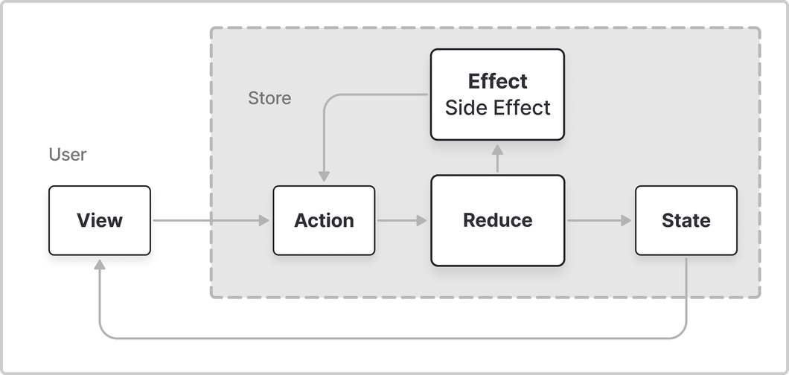

# TCA 기본 개념



- TCA는 원래의 목적을 달성하기 위해 **Single Source Truth(단일 진실 공급원)**를 따르는 단방향 구조임.
    - **Single Source Truth(단일 진실 공급원)**
        - 애플리케이션의 상태나 데이터에 대한 유일한 출처를 가진다는 의미.
        - 모든 상태 변경의 출처가 명확해지고 변경, 예측, 추적이 용이함.
- `State`
    - 변동을 추적하고 의도하지 않은 변경에서 지켜내야 할 상태.
- 사용자가 `View`를 통해서 어떤 작업이나 알림, 이벤트를 트리거 하면 연결된 `Action`이 `Reducer` 내에 구현된 함수로 `State`를 변화시키는 `Effect`를 반환함.
    - `View`(이벤트) → `Action` → `Reducer` → `Effect` → `State` 변화
    - 바로 상태를 변경 시킬수도 있고, 네트워크 통신과 같은 비동기적인 작업을 수행할 수도 있다.
        - 네트워크 통신의 경우 특정 환경과 자원이 필요한데 이것을 의존성(Dependency)을 갖게 된다고 표현함.
- 어떤 작업에 성공한 경우 `Effect`라고 하고, 실패한 경우 `Side Effect`라고 함.
- 도출된 `Effect`에 따라 다시 `Action`을 선택할 수 있음.

## 앱의 상태: State

- `Reducer`의 현재 상태를 가지는 구조체
- 비즈니스 로직을 수행하거나 UI를 그릴 때 필요한 데이터를 가지고 있음.

### State가 Equatable Struct인 이유

SwiftUI가 `View`에 표시할 정보가 변경 됐을 때 `View`를 자동으로 업데이트 함.
따라서, 상태 변화를 감지하는데 이전과 동일한 상태로의 변경을 필터링해서 불필요한 렌더링을 방지함.

## 상태 변화를 일으키는 모든 동작: Action

디바이스와 사용자 인터액션을 받아오기 위해서 존재함.
사용자 탭 이벤트와 같이 직관적인 동작 뿐 아니라, 알림 창을 닫거나 API 요청을 받는 등의 복잡한 동작들도 추가할 수 있음.
`Action`이 `Reducer`의 `State`를 변경하거나 외부 통신을 하는 Effect를 반환하도록 트리거 함.

### ⚡네이밍 컨벤션

```swift
enum Action: Equatable {
	// 추천
	/* ✅ */ case incrementButtonTapped 
	// 비추천
  /* ❌ */ case incrementCount        
}
```

- `Reducer`에서 수행할 로직이 아니라 사용자가 UI에서 수행한 작업을 이름으로 사용하는 것이 좋음
- 로직에 의한 네이밍은 단편적인 정보만을 갖고 있지만, 사용자가 수행한 작업에 의한 네이밍은 명확함.

## 변경을 처리한다: Reducer

현재의 `State`를 주어진 `Action`을 바탕으로 어떻게 다음 `State`로 바꿀 것인지를 묘사하고, 어떤 결과(`Effect`)가 존재한다면 `Store`를 통해 어떻게 실행 되어야 하는지를 설명하는 **프로토콜**임.
사용자가 `View`를 통해 `Action`을 취하면, `Action`은 `Reducer`를 통해 `State`를 변화시키는 방식으로 동작한다.

```swift
// Reducer
struct Feature: Reducer {
    struct State: Equatable {
				var count = 0
    }
    
    enum Action: Equatable {
				case decrementButtonTapped
    }
    
    var body: some ReducerOf<Self> {
        Reduce { state, action in
            switch action {
            case .decrementButtonTapped:
                state.count -= 1
                return .none
            }
        }
    }
//    위 body 클로저나 아래 reduce 함수 둘 중 한 가지 방법으로 구현.
//    func reduce(into state: inout State, action: Action) -> Effect<Action> {
//        switch action {
//        case .decrementButtonTapped:
//            state.count -= 1
//            return .none
//        }
//    }

}
```

### func reduce(into:action:)와 body

```swift

// Reducer 프로토콜의 정의 중
public protocol Reducer<State, Action> {
    /* code */
    func reduce(into state: inout State, action: Action) -> Effect<Action>
    
    @ReducerBuilder<State, Action>
    var body: Body { get }
}
```

- `Reducer`를 구현하는 방식은 2가지가 있다.
    1. `reduce(into:action:)`
        - 더 기본적인 방법임.
        - `Reducer`의 로직을 함수내에 직접 구현하는 방식임.
        - 다른 `Reducer`와 조합이 필요 없는 경우에 사용하면 됨.
    2. `body`
        - `reduce` 함수보다 더 고수준적인 방식임.
        - `body` 속성 내에서 직접 `State` 변경 및 `Effect` 방출 로직을 수행하지 않고, 여러 다른 `Reducer`들을 조합하는 방식으로 주로 사용됨.
        - `Reducer`가 더 작은 조각으로 나누어 지는 경우에 유용함.
        - 연산 프로퍼티의 타입으로 `some Reducer`를 사용하게 되는데 메소드와 달리 불투명 타입(Opaque Type)을 방출할 수 있으므로 연산프로퍼티로 만든 `Reducer`끼리 조합이 가능해 짐.

## Dependency

의존성 주입을 위해 사용됨.

```swift
struct CounterFeature: Reducer {
    @Dependency(\.continuousClock) var clock
    
    var body: some ReducerOf<Self> {
        Reduce { state, action in
            switch action {
            case .toggleTimerButtonTapped:
                state.isTimerOn.toggle()
                if state.isTimerOn {
                    return .run { send in
                        // 주입된 의존성 활용
                        for await _ in self.clock.timer(interval: .seconds(1)) {
                            await send(.timerTicked)
                        }
                    }
                    .cancellable(id: CancelID.timer)
                } else {
                    // Stop the timer
                    return .cancel(id: CancelID.timer)
                }
            }
        }
    }
}
```

## ❓Reducer가 프로토콜로 바뀐 이유

- TCA 1.0 이전의 `Reducer`는 프로토콜이 아니었음.
- Swift 5.7에서 추가된 불투명 타입을 파라미터로 넣을 수 있게되어 추상화 수준을 높이고 모듈화를 더 쉽게 해줌.

# Effect

## Action에 따른 결과:  Effect

- `Reducer`의 액션이 반환하는 타입으로, 액션을 거친 모든 결과물이라고 볼 수 있다. 그 중 외부에서 어떠한 처리가 일어나서 얻게된 예상과는 다른 결과물을 Side Effect라고 한다.
- `Action`과는 달리 `State`를 직접 변경하는 것이 아니라, 비동기적인 작업을 수행하고 그 결과를 `Action`으로 반환하여 `State`에 반영한다.

### Effect의 역할

1. 비동기 작업 관리
    - 네트워크 요청, 데이터 로딩, 파일 다운로드 등 다양한 비동기 작업을 `Effect`를 통해 관리할 수 있음.
2. Side Effect 분리
    - `Effect`는 순수 함수형 프로그래밍 원칙에 따라서 Side Effect를 배제한다. 이를 통해서 `State`에 변화를 주는 부분(`Action`)과 Side Effect를 처리하는 부분을 명확히 분리한다.
    이로써 코드의 가독성 및 추론력이 올라가고, 테스트와 디버깅이 용이하다.
3. 취소 및 에러 핸들링
    - `Effect`는 비동기 작업의 성공, 실패 및 중단을 관리하는 데 사용된다. 예를 들어, 네트워크 요청 중에 발생한 오류를 적절하게 처리하고 `State`를 업데이트할 수 있다.
4. 순서보장
    - `Effect`는 순차적으로 실행되며 순서가 보장된다. 이로써 `State`와 관련된 처리를 예측 가능하게 처리할 수 있다.

## 순수 함수적인 Effect

- 순수 함수는 주어진 입력에 대해 항상 동일한 출력을 반환하고, 외부 상태를 변경하지 않으며, 부수 효과(Side Effect)가 없는 함수를 의미한다. 그렇기 때문에 순수 함수 자체로는 비동기 작업이나 Side Effect를 처리할 수 없다.
- Effect는 State를 직접 변경하지 않고 비동기 작업을 수행한 후 Action을 반환하여 State를 변경하는 방식으로 동작한다.
즉, Effect 자체가 순수 함수라기 보다는 순수 함수적인 방법으로 Side Effect를 관리한다고 볼 수 있다.

<aside>
💡 **Effect와 Combine의 상관관계**
Combine의 `Publisher`는 데이터 흐름의 특성을 정의하고, `Subscriber`에게 전달하는 역할을 한다. `Subscriber`는 `Publisher`가 발행하는 데이터 흐름을 구독하고 이벤트나 값을 처리한다.
`Effect`는 `Publisher`와 대응되고, `Subscriber`는 `Effect.run`과 대응된다.

</aside>

<aside>
💡 **Effect와 Action**
`Action`은 사용자 인터페이스에서 발생하는 이벤트를 캡슐화해서 `State` 변화를 만드는데 사용한다. 버튼 클릭, 텍스트 입력등의 사용자 이벤트가 수신될 수도 있고, 타이머 완료, 네트워크 응답등의 시스템 이벤트도 `Action`으로 처리될 수 있다.
반면에, `Effect`는 비동지 작업을 처리하고 그 결과를 다시 `Action`으로 변환하는 역할을 한다. `Effect`는 주로 외부 세계(네트워크 요청, DB접근)와의 상호작용을 위해서 사용된다.

</aside>

## Effect의 주요 메서드

1. `none`
    - `Effect`를 반환하긴 해야하는데 아무런 동작도 취하고 싶지 않을때 사용한다.
    
    ```swift
    struct CounterFeature: Reducer {
        
        struct State: Equatable {/* code */}
      
        enum Action {/* code */}
        
        var body: some ReducerOf<Self> {
            Reduce { state, action in
                switch action {
                // 버튼을 눌렀을 땐 비동기 처리가 필요하지 않기 떄문에 .none을 반환한다.
                case .incrementButtonTapped:
                    state.count += 1
                    return .none
                case .decrementButtonTapped:
                    state.count -= 1
                    return .none
            }
        }
    }
    ```
    
2. `send`
    - 파라미터로 `Action`을 받는다. 특정 `Action` 이후로 동기적으로 다른 액션이 필요한 경우에 사용한다. 주로 자식 컴포넌트에서 부모 컴포넌트로 데이터를 전달하는 경우에 사용된다.
    - 문서상에서는 로직을 공유하기 위한 목적으로 사용하지 말 것을 권장한다.(그렇게 사용중이 었는데;;)
    코드의 중복이 발생할 수도 있고, TCA의 핵심 철학인 단방향 데이터 흐름을 저해하며 코드의 의도를 파악하기가 힘들어진다.
3. `run`
    
    ```swift
    //.run method에 들어가는 operation 인자
    operation: @escaping @Sendable (_ send: Send<Action>) async throws -> Void
    ```
    
    - 비동기 작업을 래핑하는 메소드이다. 파라미터로 비동기 클로저를 받고 있고, 클로저 내부에서 `send`를 사용하여 액션을 전달할 수 있다.
    
    ```swift
    // 사용예
    case .aButtonTapped:
    return .run { send in
        for await event in self.events() {
            send(.event(event))
        }
    }
    ```
    
    - `.run`으로 비동기 작업을 수행하고 `send` 매개변수를 통해 액션을 전달함.
    - `for await`으로 `self.events()`라는 비동기 스트림을 처리한 후 `send`가 호출되어 해당 액션을 처리하게 됨.
4. `cancellable(id:cancelInFlight:)`와 `cancel(id:)`
    - `cancellable`은 `Effect`를 취소하게 만들어주는 메소드임.
    - 파라미터
        - `id`: `Effect`를 구분하는 값
        - `cancelInFlight`: 같은 id로 아직 실행되지 않은 `Effect`도 모두 함께 취소할 지 여부. 기본값은 `false`.
    
    ```swift
    case .toggleTimerButtonTapped:
    state.isTimerOn.toggle()
    if state.isTimerOn {
        return .run { send in
            while true {
                try await Task.sleep(for: .seconds(1))
                await send(.timerTicked)
            }
        }
        .cancellable(id: CancelID.timer)
        // Start the timer
    } else {
        // Stop the timer
        return .cancel(id: CancelID.timer)
    }
    ```
    
    - `toggleTimerButtonTapped` 액션이 들어오면 `.run`이 실행되고 1초마다 `timerTicked` 가 호출된다.
    다시 `toggleTimerButtonTapped`가 호출되면 else 구문에서 `cancel`이 반환되어 `CancelID.timer`로 등록된 `Effect`가 취소된다.
5. `merge`와 `concatenate`
    - 둘 다 여려개의 `Effect`를 묶어서 반환하는 기능임.
    - `merge`
        - `Effect`들이 동시에 수행되므로 순서가 보장되지 않음.
    - `concatenate`
        - `Effect`들이 순서대로 수행됨.

## Effect 활용하기(Side Effect)

- TCA에서 Side Effect는 앱의 주요 로직과 별개로 발생하는 작업을 의미함.
- 외부 서비스와의 상호작용, 비동기 작업 처리등을 포함하는데, 이러한 Side Effect는 코드의 복잡성을 높이고 테스트를 어렵게 한다.
- 에러 처리 또한 Side Effect중 하나로 에러가 발생하면 적절한 `Action`을 생성하고 `State`에 반영한다.

### 예제 코드

```swift
import ComposableArchitecture
import Speech
import SwiftUI

struct RecordMeetingFeature: Reducer {
    struct State: Equatable {
        /* code */
        var durationRemaining: Duration {
            self.standup.duration - .seconds(self.secondsElapsed)
        }
    }
    enum Action: Equatable {
        case endMeetingButtonTapped
        case nextButtonTapped
        case timerTicked
    }
    /* code */
    var body: some ReducerOf<Self> {
        Reduce { state, action in
            switch action {
            case .endMeetingButtonTapped:
                return .none
                
            case .nextButtonTapped:
                return .none
                
            case .onTask:
                return .run { send in
                    let status = await withUnsafeContinuation { continuation in
                        SFSpeechRecognizer.requestAuthorization { status in
                            continuation.resume(with: .success(status))
                        }
                    }
                    /* code */
                }
                
            case .timerTicked:
                state.secondsElapsed += 1
                return .none
            }
        }
    }
}

struct RecordMeetingView: View {
    let store: StoreOf<RecordMeetingFeature>
    
    var body: some View {
        WithViewStore(self.store, observe: { $0 }) { viewStore in
            /* code */
                .task { await viewStore.send(.onTask).finish() }
        }
    }
}
```

- 회의 녹음 앱이며, 녹음을 하기 위해서는 음성 인식에 대한 권한을 요청해야 한다. → Side Effect
- 뷰가 시작되자마자 바로 권한 요청을 수행한다.
    - SwiftUI의 `task` 함수를 사용하여 비동기 작업을 수행하며, `View`가 사라지면 작업도 자동으로 취소되도록 구현한다.
    - `onTask` `Action`을 전달하고 해당 `Effect`가 완료될 때 까지 기다린다.(완료 될 때까지 일시 정지.)

## Store

- `Store`는 런타임동안 `Reducer` 인스턴스를 관리하는 참조 타입의 객체이다.
- 앱의 상태와 액션을 관리하고, 상태변화를 감지하며 이에 따른 액션을 처리한다.

```swift
// CounterView.swift
let store: Store<CounterFeature.State, CounterFeature.Action>

// 아래와 같이 축약형으로 선언도 가능
let store: StoreOf<CounterFeature>
```

### scope**(state:action:)**

- 현재 `store`보다 하위 `State` 및 `Action`을 다루는 `store`로 변환할 수 있음.

3개의 탭으로 이루어진 화면으로 예시

```swift
struct State {
    var activity: Activity.State
    var profile: Profile.State
    var search: Search.State
}

enum Action {
    case activity(Activity.Action)
    case profile(Profile.Action)
    case search(Search.Action)
}

struct AppView: View {
    let store: StoreOf<AppFeature>
    
    var body: some View {
        TabView {
            ActivityView(
                store: self.store.scope(state: \.activity, action: AppFeature.Action.activity)
            )
            .tabItem { Text("Activity") }
            
            SearchView(
                store: self.store.scope(state: \.search, action: AppFeature.Action.search)
            )
            .tabItem { Text("Search") }
            
            ProfileView(
                store: self.store.scope(state: \.profile, action: AppFeature.Action.profile)
            )
            .tabItem { Text("Profile") }
        }
    }
}
```

`scope`를 통해서 도메인을 더 작은 단위로 쪼갤수가 있으므로, 모듈화와 유연성 측면에서 좋다.

## ❓Store가 Thread Safe하지 않은 이유

- `Store`는 참조타입이므로 `Store`에 `Action`이 전달될 때 현재 `State`에서 `Reducer`가 실행됨.
- 만약, `Action`이 서로 다른 스레드에서 전달된다면 `State`의 값을 동시에 수정하려는 시도가 생길 수 있음.
따라서, 모든 `Action`은 동일한 스레드에서 전달받아야 한다.
